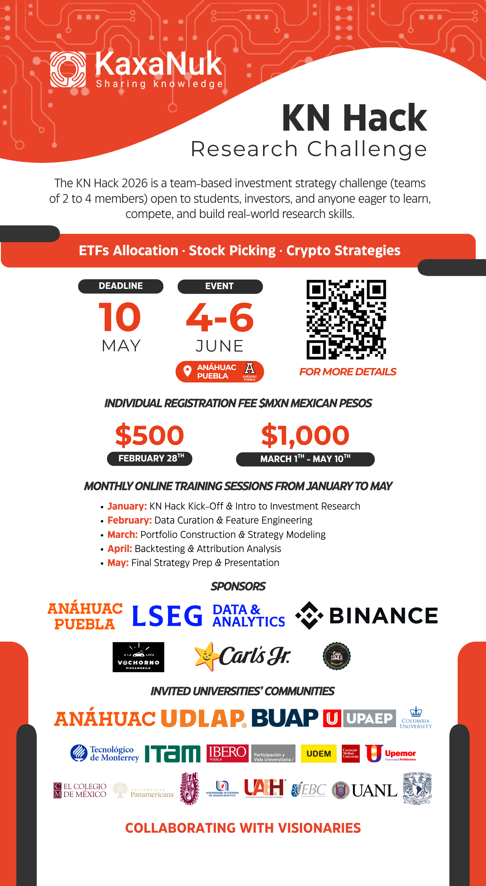

# Research Challenge 2026

The KN Hack 2026 is a team-based investment strategy challenge (teams of 2 to 4 members) open to students, investors, and anyone eager to learn, compete, and build real-world research skills.

# Investment Strategy Example

The `Investment_Strategy_Example/` folder contains a full, runnable stock-picking strategy built on the KaxaNuk framework. It is organized as three sequential steps:

## Step 1 — Data Curator

Downloads market and fundamental data from your configured data providers (Financial Modeling Prep, LSEG Workspace, or Yahoo Finance), runs custom signal calculations (e.g. the 50/200-day SMA crossover signal), and writes enriched per-ticker datasets to `Data_Curator/` as CSV and Parquet files.

Configuration lives in `Config/data_curator_parameters.xlsx`. API keys go in `Config/.env` (copy from `Config/.env_template`).

Open and run `Investment_Strategy_Example/run_data_curator.py`.

## Step 2 — Portfolio Construction

Reads the enriched data from `Data_Curator/`, applies selection and sizing rules (liquidity-weighted, signal-filtered, capped at 20% per position), and produces a historical portfolio weights file at `Portfolio_Construction/portfolio_weights.csv`.

Open and run `Investment_Strategy_Example/run_portfolio_construction.py`.

## Step 3 — Backtest Engine

Uses the KaxaNuk Backtest Engine library to run a historical simulation over the portfolio weights produced in Step 2. Configuration lives in `Config/backtest_engine_parameters.xlsx`. Results and a performance dashboard are written to `Backtest_Engine/`.

Open and run `Investment_Strategy_Example/run_backtest_engine.py`.

## Setup

Python >=3.12, <3.15 is required.

Install scientific and calendar libraries:

```bash
pip install numpy pandas openpyxl QuantLib
```

Install the KaxaNuk Data Curator and Yahoo Finance extension:

```bash
pip install kaxanuk.data_curator kaxanuk.data_curator_extensions.yahoo_finance
```

Install the KaxaNuk Backtest Engine (replace `https://license:{YOUR_LICENSE_KEY}@{SERVER}/simple/` with your license key):

If you already registered and paid for the KN Hack 2026, we will send you the license key via email. Please check your inbox and spam folder.

For questions please email us to software@kaxanuk.mx.

```bash
pip install kaxanuk-backtest-engine --extra-index-url https://license:{YOUR_LICENSE_KEY}@{SERVER}/simple/
```

Mark `Investment_Strategy_Example/src` as a source root in your IDE so that imports resolve correctly (in PyCharm: right-click the folder → Mark Directory as → Sources Root; in VS Code: add it to `python.analysis.extraPaths` in your settings).

Copy the environment template and fill in your API keys:

```bash
cp Config/.env_template Config/.env
# then edit Config/.env with your keys
```

---

# Sessions Videos

S01 KN Hack Kick-Off & Intro to Investment Research: https://www.youtube.com/watch?v=_jBLqYBaP-I

S02 Data Curation & Feature Engineering: https://www.youtube.com/watch?v=vydafB8UM9g

LSEG Workspace + KN Data Curator: https://youtu.be/6Au0RWgojpE

S03 Portfolio Construction & Strategy Modeling: https://youtu.be/S5bPxSiq4II

S04 Backtesting & Attribution Analysis: https://www.youtube.com/watch?v=Dj52GpLamqg

# Event Details

By registering individually, you will receive all event information and payment instructions directly to your email.

Registration form: https://docs.google.com/forms/d/e/1FAIpQLSf0E0blgT9a3K3JQe_ldihpFk7KIShldXG89MBIH2xRegTKFw/viewform

📅Event Details

Challenge Dates: June 4–6, 2026

Location: Universidad Anahuac Puebla

🕒Registration Fee (Individual):

  - MXN $500 — Early Bird (until February 28)
  - MXN $1,000 — Regular (March 1 to May 10, 2026)

🔥Limited Capacity: Only 100 teams (up to 400 participants).

Secure your spot early!

📚Monthly Online Training Sessions (Jan–May 2026)

Participants will automatically receive calendar invites and study materials.

- January: KN Hack Kick-Off & Intro to Investment Research
- February: Data Curation & Feature Engineering
- March: Portfolio Construction & Strategy Modeling
- April: Backtesting & Attribution Analysis
- May: Final Strategy Prep & Presentation

💡Topics You Can Hack

  - ETFs Asset Allocation
  - Stock Picking
  - Crypto Strategies

Questions: research@kaxanuk.mx 

KN Hack: https://www.kaxanuk.mx/kn-hack


